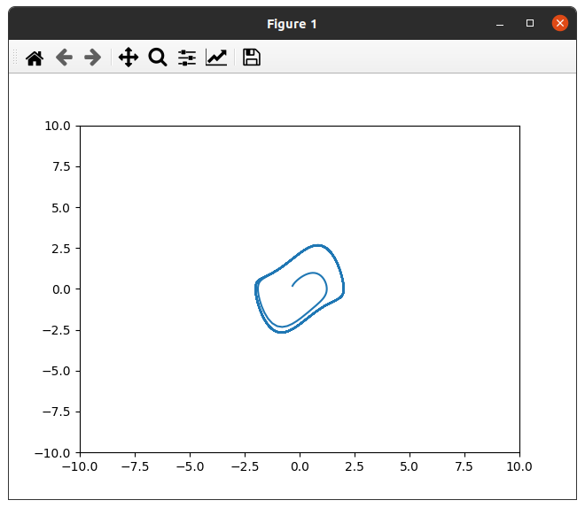

% Van der Pol oscillator

This is a simple example of a Van der Pol oscillator.

You can find some plots on it with different $\epsilon$ values.

## $\epsilon$ = 0.2

## $\epsilon$ = 1.0

## $\epsilon$ = 5.0

